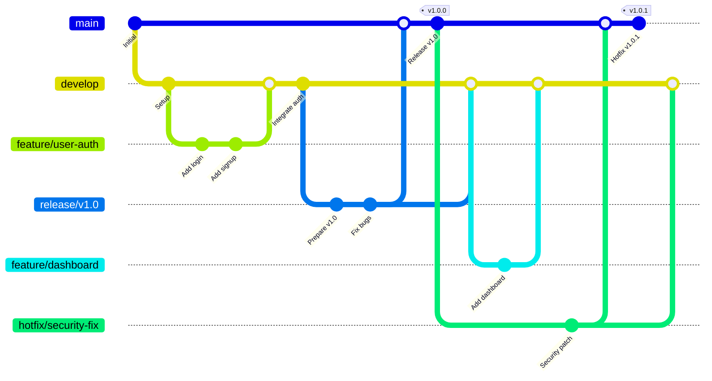

# Terraform GitHub GitFlow Module

A comprehensive, production-ready Terraform module for implementing GitFlow workflows on GitHub repositories with modern security features and enterprise-grade configuration.

## Features

- **GitFlow Implementation**: Complete GitFlow branch model (main, develop, feature, release, hotfix)
- **Branch Protection**: Advanced branch protection rules with customizable policies
- **Security Features**: GitHub Advanced Security, secret scanning, and Dependabot integration
- **Environment Management**: Development, staging, and production environments with reviewers
- **Webhook Integration**: Optional GitFlow automation webhooks
- **Compliance**: CODEOWNERS file management and required status checks
- **Validation**: Comprehensive input validation with helpful error messages

## Usage

### Basic Example

```hcl
module "github_gitflow" {
  source = "path/to/terraform-github-gitflow"

  # Required variables
  github_owner    = "your-org"
  repository_name = "your-repo"

  # Optional: Customize GitFlow settings
  enable_gitflow         = true
  main_branch_name       = "main"
  develop_branch_name    = "develop"
  repository_visibility  = "private"
}
```

### Complete Example

```hcl
module "github_gitflow" {
  source = "path/to/terraform-github-gitflow"

  # Repository Configuration
  github_owner          = "your-org"
  repository_name       = "your-repo"
  repository_visibility = "private"

  # GitFlow Configuration
  enable_gitflow           = true
  main_branch_name         = "main"
  develop_branch_name      = "develop"
  enable_feature_branches  = true
  enable_release_branches  = true
  enable_hotfix_branches   = true

  # Security Features
  enable_advanced_security                = true
  enable_secret_scanning                  = true
  enable_secret_scanning_push_protection  = true
  enable_dependabot_security_updates      = true

  # Branch Protection
  main_branch_require_signed_commits    = true
  develop_branch_require_signed_commits = false
  dismiss_stale_reviews                 = true
  require_code_owner_reviews            = true
  require_last_push_approval            = false

  # Status Checks
  main_branch_status_checks    = ["ci/build", "ci/test"]
  develop_branch_status_checks = ["ci/build"]

  # Environments
  enable_dev_environment   = true
  enable_stage_environment = true
  enable_prod_environment  = true

  # Push Rules
  enable_push_rules          = true
  max_file_size_mb          = 5
  blocked_file_extensions   = ["exe", "zip", "tar.gz"]

  # CODEOWNERS
  enable_codeowners_file = true
  codeowners_content     = "# Global code owners\n* @your-org/admins\n"

  # Bypass Actors (use actual GitHub user/team/app IDs)
  bypass_actors = [
    {
      actor_id    = 12345678  # Replace with actual GitHub user ID
      actor_type  = "Integration"
      bypass_mode = "always"
    }
  ]

  # Webhook (optional)
  enable_webhook = false
  webhook_url    = "https://your-webhook-endpoint.com/github"
}
```

### Finding GitHub User/Team IDs

To find the numeric IDs needed for `bypass_actors`:

```bash
# Get user ID
gh api /users/username --jq '.id'

# Get team ID
gh api /orgs/your-org/teams/team-name --jq '.id'

# Get app ID
gh api /apps/app-name --jq '.id'
```

## Examples

See the `examples/` directory for complete working examples:

- [`examples/minimal/`](examples/minimal/) - Minimal configuration
- [`examples/complete/`](examples/complete/) - Full-featured setup

## Requirements

| Name | Version |
|------|---------|
| terraform | >= 1.0 |
| github | >= 6.0 |

## Providers

| Name | Version |
|------|---------|
| github | >= 6.0 |

<!-- BEGIN_TF_DOCS -->
## Requirements

| Name | Version |
|------|---------|
| <a name="requirement_terraform"></a> [terraform](#requirement\_terraform) | >= 1.0 |
| <a name="requirement_github"></a> [github](#requirement\_github) | ~> 6.0 |

## Providers

| Name | Version |
|------|---------|
| <a name="provider_github"></a> [github](#provider\_github) | 6.6.0 |

## Modules

No modules.

## Resources

| Name | Type |
|------|------|
| [github_repository.this](https://registry.terraform.io/providers/integrations/github/latest/docs/resources/repository) | resource |
| [github_repository_environment.this](https://registry.terraform.io/providers/integrations/github/latest/docs/resources/repository_environment) | resource |
| [github_repository_environment_deployment_policy.branch_policy](https://registry.terraform.io/providers/integrations/github/latest/docs/resources/repository_environment_deployment_policy) | resource |
| [github_repository_ruleset.branches](https://registry.terraform.io/providers/integrations/github/latest/docs/resources/repository_ruleset) | resource |
| [github_repository_ruleset.tags](https://registry.terraform.io/providers/integrations/github/latest/docs/resources/repository_ruleset) | resource |
| [github_repository_webhook.gitflow](https://registry.terraform.io/providers/integrations/github/latest/docs/resources/repository_webhook) | resource |

## Inputs

| Name | Description | Type | Default | Required |
|------|-------------|------|---------|:--------:|
| <a name="input_blocked_file_extensions"></a> [blocked\_file\_extensions](#input\_blocked\_file\_extensions) | File extensions to block in push rules. | `list(string)` | <pre>[<br/>  "exe",<br/>  "zip",<br/>  "tar.gz",<br/>  "dmg",<br/>  "pkg",<br/>  "deb",<br/>  "rpm"<br/>]</pre> | no |
| <a name="input_bypass_actors"></a> [bypass\_actors](#input\_bypass\_actors) | List of actors (users/teams/apps) allowed to bypass restrictions. | <pre>list(object({<br/>    actor_id    = number<br/>    actor_type  = string # RepositoryRole, Team, Integration, OrganizationAdmin<br/>    bypass_mode = string # always, pull_request, push<br/>  }))</pre> | `[]` | no |
| <a name="input_codeowners_content"></a> [codeowners\_content](#input\_codeowners\_content) | Content for the CODEOWNERS file. | `string` | `"# Global code owners\n* @admins\n"` | no |
| <a name="input_commit_author_email_pattern"></a> [commit\_author\_email\_pattern](#input\_commit\_author\_email\_pattern) | Regex pattern for commit author email addresses (e.g., '@your-org.com$'). | `string` | `""` | no |
| <a name="input_conventional_commit_regex"></a> [conventional\_commit\_regex](#input\_conventional\_commit\_regex) | Regex pattern for conventional commit messages. | `string` | `"^(feat\|fix\|docs\|style\|refactor\|perf\|test\|chore)(\\(.+\\))?: .+$"` | no |
| <a name="input_default_branch"></a> [default\_branch](#input\_default\_branch) | Default branch name for the repository. | `string` | `"main"` | no |
| <a name="input_dev_env_reviewers"></a> [dev\_env\_reviewers](#input\_dev\_env\_reviewers) | List of GitHub usernames who can review development deployments. (Currently not implemented - GitHub API requires numeric user IDs) | `list(string)` | `[]` | no |
| <a name="input_develop_branch_name"></a> [develop\_branch\_name](#input\_develop\_branch\_name) | Name of the develop/integration branch. | `string` | `"develop"` | no |
| <a name="input_develop_branch_overrides"></a> [develop\_branch\_overrides](#input\_develop\_branch\_overrides) | Override settings for develop branch ruleset. | `map(any)` | `{}` | no |
| <a name="input_develop_branch_require_signed_commits"></a> [develop\_branch\_require\_signed\_commits](#input\_develop\_branch\_require\_signed\_commits) | Require signed commits on develop branch. | `bool` | `false` | no |
| <a name="input_develop_branch_status_checks"></a> [develop\_branch\_status\_checks](#input\_develop\_branch\_status\_checks) | Required status checks for develop branch. | `list(string)` | `[]` | no |
| <a name="input_dismiss_stale_reviews"></a> [dismiss\_stale\_reviews](#input\_dismiss\_stale\_reviews) | Dismiss stale reviews when new commits are pushed. | `bool` | `true` | no |
| <a name="input_enable_advanced_security"></a> [enable\_advanced\_security](#input\_enable\_advanced\_security) | Enable GitHub Advanced Security features. | `bool` | `true` | no |
| <a name="input_enable_codeowners_file"></a> [enable\_codeowners\_file](#input\_enable\_codeowners\_file) | Create and manage a CODEOWNERS file. | `bool` | `true` | no |
| <a name="input_enable_dependabot_security_updates"></a> [enable\_dependabot\_security\_updates](#input\_enable\_dependabot\_security\_updates) | Enable Dependabot security updates. | `bool` | `true` | no |
| <a name="input_enable_dev_environment"></a> [enable\_dev\_environment](#input\_enable\_dev\_environment) | Enable development environment. | `bool` | `true` | no |
| <a name="input_enable_develop_branch"></a> [enable\_develop\_branch](#input\_enable\_develop\_branch) | Create and manage the develop branch (automatically enabled when enable\_gitflow is true). | `bool` | `true` | no |
| <a name="input_enable_feature_branches"></a> [enable\_feature\_branches](#input\_enable\_feature\_branches) | Enable feature branch protection rules. | `bool` | `true` | no |
| <a name="input_enable_gitflow"></a> [enable\_gitflow](#input\_enable\_gitflow) | Enable full GitFlow workflow (develop/release/hotfix branches). Set to false for trunk-based development. | `bool` | `true` | no |
| <a name="input_enable_hotfix_branches"></a> [enable\_hotfix\_branches](#input\_enable\_hotfix\_branches) | Enable hotfix branch protection rules. | `bool` | `true` | no |
| <a name="input_enable_prod_environment"></a> [enable\_prod\_environment](#input\_enable\_prod\_environment) | Enable production environment. | `bool` | `true` | no |
| <a name="input_enable_push_rules"></a> [enable\_push\_rules](#input\_enable\_push\_rules) | Enable push rules to restrict file types and sizes. | `bool` | `true` | no |
| <a name="input_enable_release_branches"></a> [enable\_release\_branches](#input\_enable\_release\_branches) | Enable release branch protection rules. | `bool` | `true` | no |
| <a name="input_enable_secret_scanning"></a> [enable\_secret\_scanning](#input\_enable\_secret\_scanning) | Enable secret scanning. | `bool` | `true` | no |
| <a name="input_enable_secret_scanning_push_protection"></a> [enable\_secret\_scanning\_push\_protection](#input\_enable\_secret\_scanning\_push\_protection) | Enable secret scanning push protection. | `bool` | `true` | no |
| <a name="input_enable_stage_environment"></a> [enable\_stage\_environment](#input\_enable\_stage\_environment) | Enable staging environment. | `bool` | `true` | no |
| <a name="input_enable_tag_protection"></a> [enable\_tag\_protection](#input\_enable\_tag\_protection) | Enable tag protection for release tags. | `bool` | `true` | no |
| <a name="input_enable_webhook"></a> [enable\_webhook](#input\_enable\_webhook) | Enable GitFlow automation webhook. | `bool` | `false` | no |
| <a name="input_github_base_url"></a> [github\_base\_url](#input\_github\_base\_url) | GitHub base URL for GitHub Enterprise Server. Leave null for github.com. | `string` | `null` | no |
| <a name="input_github_max_retries"></a> [github\_max\_retries](#input\_github\_max\_retries) | Maximum number of retries for a request. | `number` | `3` | no |
| <a name="input_github_owner"></a> [github\_owner](#input\_github\_owner) | GitHub user or organisation that owns the repository. | `string` | n/a | yes |
| <a name="input_github_read_delay_ms"></a> [github\_read\_delay\_ms](#input\_github\_read\_delay\_ms) | Time in milliseconds to sleep between reads to avoid rate limiting. | `number` | `0` | no |
| <a name="input_github_retry_delay_ms"></a> [github\_retry\_delay\_ms](#input\_github\_retry\_delay\_ms) | Time in milliseconds to sleep before retrying a request. | `number` | `1000` | no |
| <a name="input_github_retry_max_delay_ms"></a> [github\_retry\_max\_delay\_ms](#input\_github\_retry\_max\_delay\_ms) | Maximum time in milliseconds to sleep before retrying a request. | `number` | `30000` | no |
| <a name="input_github_token"></a> [github\_token](#input\_github\_token) | PAT with repo/admin:org scope. Leave unset → use GITHUB\_TOKEN env. | `string` | `null` | no |
| <a name="input_github_write_delay_ms"></a> [github\_write\_delay\_ms](#input\_github\_write\_delay\_ms) | Time in milliseconds to sleep between writes to avoid rate limiting. | `number` | `1000` | no |
| <a name="input_hotfix_branch_require_signed_commits"></a> [hotfix\_branch\_require\_signed\_commits](#input\_hotfix\_branch\_require\_signed\_commits) | Require signed commits on hotfix branches. | `bool` | `true` | no |
| <a name="input_hotfix_branch_status_checks"></a> [hotfix\_branch\_status\_checks](#input\_hotfix\_branch\_status\_checks) | Required status checks for hotfix branches. | `list(string)` | `[]` | no |
| <a name="input_main_branch_name"></a> [main\_branch\_name](#input\_main\_branch\_name) | Name of the main/production branch. | `string` | `"main"` | no |
| <a name="input_main_branch_overrides"></a> [main\_branch\_overrides](#input\_main\_branch\_overrides) | Override settings for main branch ruleset. | `map(any)` | `{}` | no |
| <a name="input_main_branch_require_signed_commits"></a> [main\_branch\_require\_signed\_commits](#input\_main\_branch\_require\_signed\_commits) | Require signed commits on main branch. | `bool` | `true` | no |
| <a name="input_main_branch_status_checks"></a> [main\_branch\_status\_checks](#input\_main\_branch\_status\_checks) | Required status checks for main branch. | `list(string)` | `[]` | no |
| <a name="input_manage_topics_in_terraform"></a> [manage\_topics\_in\_terraform](#input\_manage\_topics\_in\_terraform) | Whether to manage repository topics in Terraform (true) or allow manual UI edits (false). | `bool` | `false` | no |
| <a name="input_max_file_path_length"></a> [max\_file\_path\_length](#input\_max\_file\_path\_length) | Maximum file path length for push rules (0 = disabled). | `number` | `0` | no |
| <a name="input_max_file_size_mb"></a> [max\_file\_size\_mb](#input\_max\_file\_size\_mb) | Maximum file size in MB for push rules. | `number` | `5` | no |
| <a name="input_prod_env_reviewers"></a> [prod\_env\_reviewers](#input\_prod\_env\_reviewers) | List of GitHub usernames who can review production deployments. (Currently not implemented - GitHub API requires numeric user IDs) | `list(string)` | `[]` | no |
| <a name="input_release_branch_require_signed_commits"></a> [release\_branch\_require\_signed\_commits](#input\_release\_branch\_require\_signed\_commits) | Require signed commits on release branches. | `bool` | `true` | no |
| <a name="input_release_branch_status_checks"></a> [release\_branch\_status\_checks](#input\_release\_branch\_status\_checks) | Required status checks for release branches. | `list(string)` | `[]` | no |
| <a name="input_repo_allow_merge_commit"></a> [repo\_allow\_merge\_commit](#input\_repo\_allow\_merge\_commit) | Allow merge commits for pull requests. | `bool` | `true` | no |
| <a name="input_repo_allow_rebase_merge"></a> [repo\_allow\_rebase\_merge](#input\_repo\_allow\_rebase\_merge) | Allow rebase merging for pull requests. | `bool` | `true` | no |
| <a name="input_repo_allow_squash_merge"></a> [repo\_allow\_squash\_merge](#input\_repo\_allow\_squash\_merge) | Allow squash merging for pull requests. | `bool` | `true` | no |
| <a name="input_repo_has_projects"></a> [repo\_has\_projects](#input\_repo\_has\_projects) | Enable repository projects. | `bool` | `false` | no |
| <a name="input_repo_has_wiki"></a> [repo\_has\_wiki](#input\_repo\_has\_wiki) | Enable repository wiki. | `bool` | `false` | no |
| <a name="input_repository_name"></a> [repository\_name](#input\_repository\_name) | Name of the repository to manage. | `string` | n/a | yes |
| <a name="input_repository_topics"></a> [repository\_topics](#input\_repository\_topics) | Optional list of repository topics to manage when manage\_topics\_in\_terraform is true. | `list(string)` | `[]` | no |
| <a name="input_repository_visibility"></a> [repository\_visibility](#input\_repository\_visibility) | Repository visibility: public, private, or internal. | `string` | `"private"` | no |
| <a name="input_require_code_owner_reviews"></a> [require\_code\_owner\_reviews](#input\_require\_code\_owner\_reviews) | Require code owner reviews. | `bool` | `false` | no |
| <a name="input_require_last_push_approval"></a> [require\_last\_push\_approval](#input\_require\_last\_push\_approval) | Require approval from someone other than the last pusher. | `bool` | `false` | no |
| <a name="input_required_workflows"></a> [required\_workflows](#input\_required\_workflows) | List of required GitHub Actions workflows that must pass. | <pre>list(object({<br/>    path       = string<br/>    repository = string<br/>    ref        = optional(string, "main")<br/>  }))</pre> | `[]` | no |
| <a name="input_restricted_file_extensions"></a> [restricted\_file\_extensions](#input\_restricted\_file\_extensions) | File extensions to restrict in push rules. | `list(string)` | `[]` | no |
| <a name="input_restricted_file_paths"></a> [restricted\_file\_paths](#input\_restricted\_file\_paths) | File paths to restrict in push rules (using fnmatch patterns). | `list(string)` | `[]` | no |
| <a name="input_set_develop_as_default"></a> [set\_develop\_as\_default](#input\_set\_develop\_as\_default) | Set develop branch as the default branch (not recommended for GitFlow). | `bool` | `false` | no |
| <a name="input_stage_env_reviewers"></a> [stage\_env\_reviewers](#input\_stage\_env\_reviewers) | List of GitHub usernames who can review staging deployments. (Currently not implemented - GitHub API requires numeric user IDs) | `list(string)` | `[]` | no |
| <a name="input_webhook_events"></a> [webhook\_events](#input\_webhook\_events) | List of events to trigger webhook. | `list(string)` | <pre>[<br/>  "push",<br/>  "pull_request",<br/>  "release"<br/>]</pre> | no |
| <a name="input_webhook_insecure_ssl"></a> [webhook\_insecure\_ssl](#input\_webhook\_insecure\_ssl) | Allow insecure SSL for webhook. | `bool` | `false` | no |
| <a name="input_webhook_secret"></a> [webhook\_secret](#input\_webhook\_secret) | Webhook secret for GitFlow automation. | `string` | `""` | no |
| <a name="input_webhook_url"></a> [webhook\_url](#input\_webhook\_url) | Webhook URL for GitFlow automation. | `string` | `""` | no |

## Outputs

| Name | Description |
|------|-------------|
| <a name="output_branch_rulesets"></a> [branch\_rulesets](#output\_branch\_rulesets) | Map of all branch rulesets with their IDs and enforcement status. |
| <a name="output_develop_branch_name"></a> [develop\_branch\_name](#output\_develop\_branch\_name) | Name of the develop branch (null if disabled). |
| <a name="output_develop_branch_ruleset_id"></a> [develop\_branch\_ruleset\_id](#output\_develop\_branch\_ruleset\_id) | Ruleset ID for the develop branch (null if disabled). |
| <a name="output_environments"></a> [environments](#output\_environments) | Map of all environments with their URLs and settings. |
| <a name="output_gitflow_configuration"></a> [gitflow\_configuration](#output\_gitflow\_configuration) | Complete GitFlow configuration summary. |
| <a name="output_main_branch_name"></a> [main\_branch\_name](#output\_main\_branch\_name) | Name of the main branch. |
| <a name="output_main_branch_ruleset_id"></a> [main\_branch\_ruleset\_id](#output\_main\_branch\_ruleset\_id) | Ruleset ID for the main branch. |
| <a name="output_push_rules_ruleset_id"></a> [push\_rules\_ruleset\_id](#output\_push\_rules\_ruleset\_id) | Ruleset ID for push restrictions (not yet supported by provider). |
| <a name="output_repository_clone_url"></a> [repository\_clone\_url](#output\_repository\_clone\_url) | Clone URL for the repository. |
| <a name="output_repository_html_url"></a> [repository\_html\_url](#output\_repository\_html\_url) | Link to the GitHub repository. |
| <a name="output_repository_ssh_clone_url"></a> [repository\_ssh\_clone\_url](#output\_repository\_ssh\_clone\_url) | SSH clone URL for the repository. |
| <a name="output_security_features"></a> [security\_features](#output\_security\_features) | Status of all security features enabled on the repository. |
| <a name="output_tag_protection_ruleset_id"></a> [tag\_protection\_ruleset\_id](#output\_tag\_protection\_ruleset\_id) | Ruleset ID for tag protection (null if disabled). |
<!-- END_TF_DOCS -->

## GitFlow Workflow

This module implements the standard GitFlow workflow:



### Branch Types

- **main**: Production-ready code
- **develop**: Integration branch for features
- **feature/**: New features (merged to develop)
- **release/**: Release preparation (merged to main and develop)
- **hotfix/**: Critical fixes (merged to main and develop)

## Security Considerations

- Enable GitHub Advanced Security for comprehensive scanning
- Use signed commits for production branches
- Configure appropriate bypass actors with minimal permissions
- Regularly review and update CODEOWNERS
- Monitor security alerts and Dependabot updates

## Contributing

1. Fork the repository
2. Create a feature branch
3. Make your changes
4. Add tests if applicable
5. Submit a pull request

## License

This module is released under the MIT License. See [LICENSE](LICENSE) for details.
