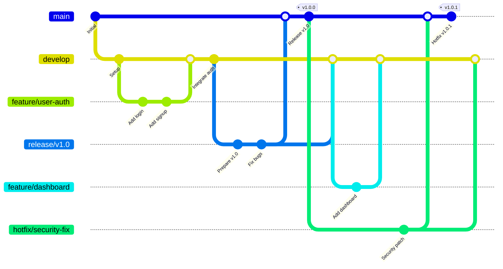

# Terraform GitHub GitFlow Module

A comprehensive, production-ready Terraform module for implementing GitFlow workflows on GitHub repositories with modern security features and enterprise-grade configuration.

## Features

- **GitFlow Implementation**: Complete GitFlow branch model (main, develop, feature, release, hotfix)
- **Branch Protection**: Advanced branch protection rules with customizable policies
- **Security Features**: GitHub Advanced Security, secret scanning, and Dependabot integration
- **Environment Management**: Development, staging, and production environments with reviewers
- **Webhook Integration**: Optional GitFlow automation webhooks
- **Compliance**: CODEOWNERS file management and required status checks
- **Validation**: Comprehensive input validation with helpful error messages

## GitFlow Workflow

This module implements the standard GitFlow workflow:

### Branch Types

- **main**: Production-ready code
- **develop**: Integration branch for features
- **feature/**: New features (merged to develop)
- **release/**: Release preparation (merged to main and develop)
- **hotfix/**: Critical fixes (merged to main and develop)

## Security Considerations

- Enable GitHub Advanced Security for comprehensive scanning
- Use signed commits for production branches
- Configure appropriate bypass actors with minimal permissions
- Regularly review and update CODEOWNERS
- Monitor security alerts and Dependabot updates

## Contributing

1. Fork the repository
2. Create a feature branch
3. Make your changes
4. Add tests if applicable
5. Submit a pull request

## License

This module is released under the MIT License. See [LICENSE](LICENSE) for details.
